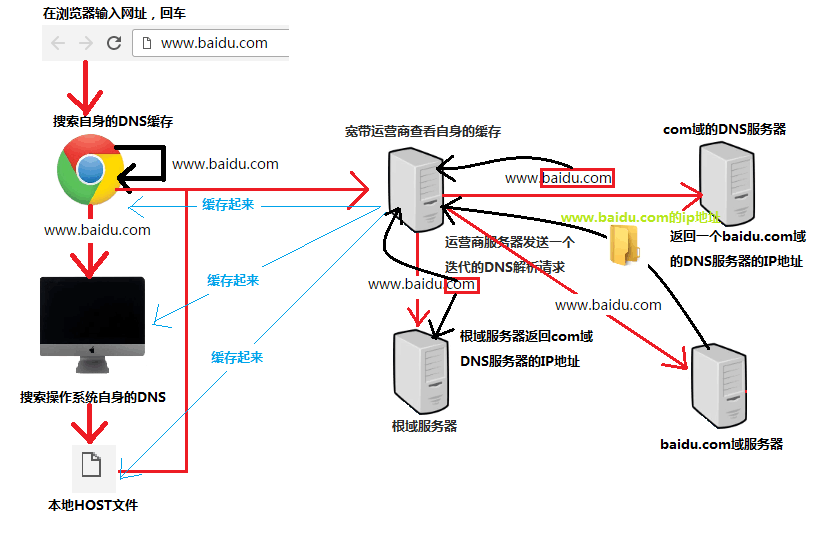

## HTTP
### 什么是HTTP？
HTTP就是一种协议，计算机之间要共同遵守这种协议的规则，才能彼此通信，现在不仅仅是局限于计算机就像手机、冰箱等这些智能终端都是要遵循这个协议

### HTTP使用流程
1. http客户端发起请求，创建端口
2. http服务器在端口监听客户端请求
3. http服务器向客户端返回状态和内容
- 比如在电脑的浏览器中输入一个网址
- 那么就创建了一个到服务器指定端口的TCP连接
- http服务器在端口监听客户端请求，http服务器一旦监听到请求
- http服务器向客户端返回状态和内容，比如200的一个状态码
- 同时返回内容，比如请求的文件、错误信息、JSON数据等等。

### 域名解析原理
1. Chrome搜索自身的DNS缓存
2. 搜索操作系统自身的DNS缓存
3. 读取本地的HOST文件
4. 浏览器发起一个DNS的系统调用
5. 浏览器获得域名对应的IP地址后，发起HTTP"三次握手"
6. TCP/IP连接建立起来以后，浏览器就可以向服务器发送HTTP请求了
7. 服务器端接受到了这个请求，根据路径参数，经过后端的一些处理之后，把处理后的一个结果的数据返回给浏览器
8. 浏览器拿到完整的HTML页面代码，在解析和渲染这个页面的时候，里面的JS、CSS、图片静态资源，他们同样也是一个个的HTTP请求，同样要经过上面的主要的七个步骤
9. 浏览器根据拿到的资源对页面进行渲染，最终把一个完整的页面呈现给了用户

- 说的更通俗点就是
- 当在电脑的浏览器上输入一个网址www.baidu.com的时候，点击回车或是使用F5刷新时
- 可能经过很短的时间，然后页面就渲染出来了
- 但是在这里面，计算机和浏览器做了许许多多的事情
- 首先是域名解析，假如我们使用的是Chrome浏览器
- 那么chrome会先搜索浏览器自身的DNS缓存，看自身的DNS的缓存中有没有www.baidu.com这个域名以及缓存的IP地址
- 这个缓存的时间一般大概只有1分钟，如果有缓存，就看看有没有过期，如果没有过期这个解析就结束了
- 我们可以通过在Chrome中输入chrome://net-internals/#dns，这里就可以查看你曾经浏览过的网站的DNS缓存记录
- 如果说浏览器没有找到缓存，或者说这个缓存失效
- Chrome就会搜索操作系统自身的DNS缓存，如果找到且没有过期就会停止搜索，解析就到此结束
- 如果操作系统的DNS缓存也没有找到，就会尝试去读取本地的host文件
- 如果在host文件中也没有找到对应的配置项，那么浏览器就会发起一个DNS的系统调用
- 就会向本地宽带运营商提供的主控服务器发起的一个域名解析请求
- 运营商的服务器首先会查找自身的缓存，找到自身的条目
- 如果满足要求，那么解析就成功了
- 如果说没有找到这个条目，运营商的服务器会代替我们的浏览器发起一个迭代的DNS的解析请求
- 它首先会去找根域的ip地址，就会去问他有没有www.baidu.com的域名地址
- 根域发现这是一个com的顶级域名，于是就返回给运营商的服务器com域的DNS的服务器的ip地址
- 于是运营商服务器拿到了com顶级域的ip地址，然后就像com域的DNS服务器询问www.baidu.com的域名地址
- com域的DNS服务器知道baidu.com这个域的ip地址，又将baidu.com这个域的ip地址告诉运营商服务器
- 然后运营商服务器通过这个ip地址找到baidu.com的DNS服务器，这个一般是由这个域名的注册商提供的
- 然后运营商服务器会询问www.baidu.com这个域名的ip地址是什么，然后baidu.com这个域名服务器找到www.baidu.com这个域名的ip地址
- 于是就将找到的结果发送给运营商的DNS服务器
- 这个时候运营商服务器把结果返回操作系统内核同时缓存起来，当然这个缓存有可能会失效
- 然后内核从DNS服务器拿到ip地址又吧这个结果返回给浏览器
- 最终浏览器拿到了www.baidu.com对应的ip地址
- 浏览器获得域名对应的IP地址后，发起HTTP"三次握手"
- 浏览器就会以一个随机端口向服务器的Web程序发起一个TCP连接请求
- 这个连接请求通过层层的路由设备到达服务器后，经过网卡，然后进入到内核的TCP/IP协议栈，还可能经过防火墙的过滤，最终到达web服务端
- 然后就建立起这个TCP/IP的连接
- 那么这三次握手干了什么？
- 把我们本地的电脑看成一个客户端，然后在很远的地方有一个服务器
- 客户端会向服务器发送一个是否可以连接的请求报文
- 然后服务器空闲就会返回一个可以连接的响应报文
- 客户端接受到了响应报文就会向服务器发送请求资源的要求。
- TCP/IP连接建立起来以后，浏览器就可以向服务器发送HTTP请求了
- 就如用HTTP的GET方法请求一个根域里的一个域名
- 协议可以采取http1.0的一个协议
- 然后这个请求发送后，服务器端接受到了这个请求，根据路径参数，经过后端的一些处理之后，把处理后的一个结果的数据返回给浏览器
- 如果是百度的页面，就会把完整的百度主页的HTML页面代码返回给浏览器
- 浏览器拿到完整的HTML页面代码，在解析和渲染这个页面的时候
- 里面的JS、CSS、图片静态资源，他们同样也是一个个的HTTP请求，同样要经过上面的主要的七个步骤。
- 最终浏览器根据拿到的资源对页面进行渲染，最终把一个完整的页面呈现给了用户

### http头和正文信息
http头发送的是一些附加信息，服务器发送响应日期、http状态码

### 正文信息
正文就是用户提交的表单数据

### Chrome开发者工具
- 按F12进入Network，刷新页面
- 拿到html的那个页面的请求
- `Headers`头信息
    + `Remote Address`远端服务器的地址，就是域名解析后的一个结果
    + `Request URL`请求地址
    + `Request Method`请求方法
    + `Request Headers`请求头
    + `Status Code`响应的状态码
    + `Response Header`响应头
- `Preview`资源预览
- `Response`响应正文
- `Cookies`请求和返回中要返回的cookies
- `Timing`图形化显示资源加载过程中每个资源所要耗费的时间线
    + `Stalled`等待时间，就是浏览器要发出这个请求到这个请求可以发出的等待时间
    + `Proxy negotiation`代理协商的时间
    + `Request sent`请求的第一个字节发出以前到最后一个字节发出后的时间，上传时间
    + `waiting(TTFB)`请求发出以后到收到响应第一个字节所花费时间，这个包括整个数据在各个路由中所延迟的时间，以及服务器端要响应这个请求所做的后台的一些处理
    + `Content Download`收到响应的第一个字节开始到接受完毕最后一个字节所花费的时间，也就是下载时间

### 请求的方法
- `GET`获取或是读取数据
- `POST`向指定的资源提交数据
- `PUT`向指定位置上传一个新的内容
- `DELETE`请求服务器删除我们标识的某个资源
- `HEAD`只请求页面的首部
- `TRACE`
- `OPTIONS`

### 状态码
状态码就是在服务器返回给浏览器的时候告诉浏览器我当前请求的一个成功或是失败的指示信息的一个状态
- `1XX`表示请求已经接受了然后继续处理
- `2XX`请求已经成功然后处理掉了
- `3XX`重定向，完成这个请求可能需要进行更进一步的操作
- `4XX`就是客户端操作，请求的时候有语法错误，或者这个请求无法实现
- `5XX`服务器端的错误
- `200`客户端请求成功
- `400`客户端请求的语法错误
- `401`请求可能没有经过授权
- `403`服务器收到一个请求，拒绝为他服务，可能没有权限等等
- `404`没有找到，请求资源不存在或者是输错了URL地址
- `500`服务器发生了一个不可预料的错误
- `503`服务器当前还不能处理这个请求

